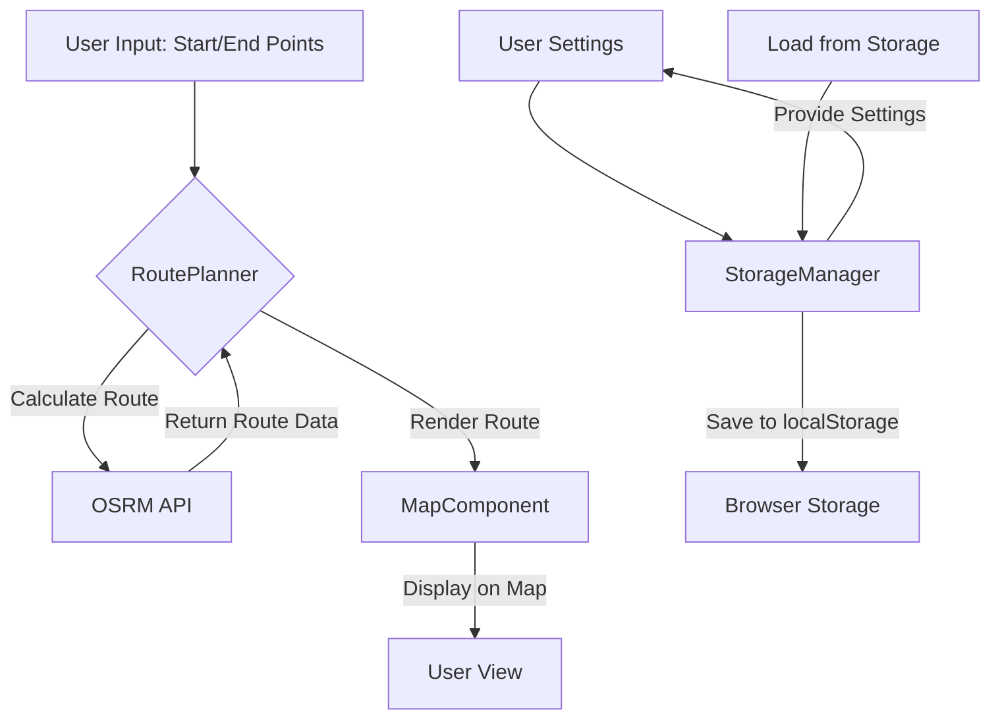

# Walking Planner Map App - Architecture Plan

## Project Overview
A TypeScript-based web application for planning walking/running routes using OpenStreetMap with local browser storage (no cloud account required).

## Technology Stack
- **Frontend**: TypeScript, HTML5, CSS3
- **Mapping Library**: Leaflet.js (OpenStreetMap compatible)
- **Storage**: localStorage API
- **Routing**: OSRM (Open Source Routing Machine) via public API or Mapbox Directions API
- **Build Tool**: Vite (for fast development and bundling)

## Project Structure

```
walk_planner_map/
├── index.html              # Main HTML entry point
├── package.json            # Node.js dependencies
├── tsconfig.json           # TypeScript configuration
├── vite.config.ts          # Vite build configuration
├── src/
│   ├── main.ts             # Application entry point
│   ├── styles/
│   │   └── global.css      # Global styles
│   ├── components/
│   │   ├── MapComponent.ts # Main map component
│   │   ├── RoutePlanner.ts # Route planning logic
│   │   ├── StorageManager.ts # localStorage wrapper
│   │   ├── UserProfile.ts  # User profile management
│   │   └── UIComponents.ts # Reusable UI components
│   └── types/
│       └── index.ts        # TypeScript type definitions
├── public/
│   └── favicon.ico         # Browser favicon
└── plans/
    └── architecture.md     # This file
```

## Component Architecture

### 1. MapComponent
- Initializes Leaflet map with OpenStreetMap tiles
- Handles user interactions (click, drag, zoom)
- Renders route polyline on the map
- Displays distance and time information

### 2. RoutePlanner
- Manages route calculation logic
- Fetches routing data from OSRM/Mapbox API
- Calculates distance, elevation, and estimated time
- Handles multiple waypoints for complex routes

### 3. StorageManager
- Wraps localStorage API
- Provides type-safe storage methods
- Handles data serialization/deserialization
- Implements data versioning for migrations

### 4. UserProfile
- Manages user settings (name, fitness level, preferred units)
- Stores saved routes and favorites
- Handles profile creation/editing

## Data Flow



## Key Features (Prototype)

1. **Map Display**: Full-screen OpenStreetMap with Leaflet.js
2. **Route Drawing**: Click map to add waypoints, drag to adjust
3. **Distance Calculation**: Real-time distance and time estimates
4. **Local Storage**: Save/load routes and settings
5. **User Preferences**: Units (metric/imperial), fitness level

## API Endpoints

- **OSRM Routing API**: `http://router.project-osrm.org/route/v2/driving/{lon1},{lat1};{lon2},{lat2}?overview=full&geometries=geojson`
- **Mapbox Directions API** (alternative): `https://api.mapbox.com/directions/v5/mapbox/walking/{start};{end}?access_token={TOKEN}`

## Storage Schema

```typescript
interface UserSettings {
  name: string;
  units: 'metric' | 'imperial';
  fitnessLevel: 'casual' | 'moderate' | 'active';
  savedRoutes: SavedRoute[];
}

interface SavedRoute {
  id: string;
  name: string;
  waypoints: Waypoint[];
  distance: number;
  duration: number;
  createdAt: string;
}

interface Waypoint {
  location: [number, number]; // [lat, lon]
  name?: string;
}
```

## Implementation Phases

### Phase 1: Project Setup
- Initialize Vite + TypeScript project
- Install Leaflet.js and dependencies
- Create basic HTML structure

### Phase 2: Core Components
- Implement MapComponent with Leaflet
- Create StorageManager for localStorage
- Build RoutePlanner with OSRM integration

### Phase 3: UI & Features
- Add waypoint input controls
- Implement route visualization
- Create settings panel

### Phase 4: Polish
- Add error handling
- Improve UX/UI
- Test across browsers
